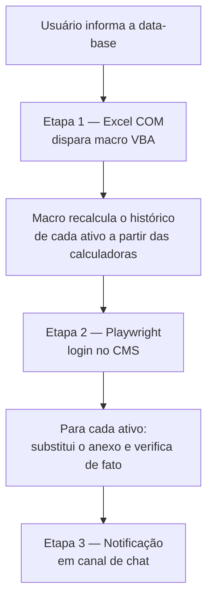

# Automação de Atualização de Preços (PU) — Excel → Site

Pipeline em Python que automatiza a publicação diária de históricos de Preço
Unitário (PU) de ativos de renda fixa no site institucional de uma
Distribuidora de Títulos e Valores Mobiliários (DTVM), eliminando uma
rotina manual repetitiva da área de Riscos.

> Este repositório é uma versão **sanitizada** de um projeto em produção:
> nomes de ativos, domínios, caminhos de rede e credenciais reais foram
> substituídos por valores genéricos/de exemplo. A lógica de negócio e a
> arquitetura são as mesmas usadas no ambiente real.

---

## 🧩 Problema

A área de Riscos precisava publicar, todo dia útil, o histórico de PU de
4 ativos (debêntures, notas comerciais e CRIs) no site da empresa. O
processo manual envolvia:

1. Atualizar cada calculadora de PU no Excel a partir de fontes de mercado;
2. Copiar os valores do dia para a planilha de histórico de cada ativo;
3. Acessar o painel administrativo do site;
4. Trocar o arquivo anexado em 4 posts diferentes (um por ativo);
5. Publicar cada post individualmente;
6. Avisar o time em um canal de chat.

Além do tempo gasto (repetido todo dia), o processo manual tinha dois
riscos concretos:

- **Erro humano** na cópia de valores ou na escolha do arquivo certo para
  cada post;
- **Falso senso de sucesso**: a interface do CMS podia "parecer" ter salvo
  o anexo sem que a troca realmente tivesse ocorrido — um problema que só
  aparecia horas depois, quando alguém notava o PU desatualizado no ar.

## ✅ Solução

Um orquestrador Python (`src/atualizar_precos.py`) que executa o fluxo
completo em uma única chamada, dividido em 3 etapas:



**Decisões de projeto que resolvem os dois riscos do processo manual:**

- **Automação ponta a ponta via COM + Playwright** — a macro VBA é
  disparada programaticamente (sem interação manual no Excel) e o
  Playwright controla o navegador headless para logar no CMS e trocar os
  anexos, removendo o passo de cópia manual e a chance de anexar o
  arquivo errado no post errado.
- **Verificação real de sucesso, não confiança na UI** — em vez de assumir
  sucesso quando um botão ou snackbar aparece na tela, o script lê o valor
  de um campo oculto do formulário antes e depois da troca e só declara
  sucesso se esse valor realmente mudou. Essa mudança nasceu de um bug em
  produção: o upload "parecia" funcionar (elementos de UI reagiam
  normalmente), mas o anexo não era trocado porque os controles do
  formulário só ficavam clicáveis via hover — inatingível em modo
  headless. A causa raiz foi confirmada com um script de diagnóstico
  somente leitura antes de qualquer correção.
- **Falhas parciais são explícitas, não silenciosas** — se algum ativo
  falhar, o pipeline não afirma "sucesso" para o time; ele lista qual
  ativo falhou e por quê, salva um screenshot de diagnóstico e pergunta ao
  usuário antes de notificar o canal (para não notificar "sucesso" quando
  houve falha parcial).
- **Recálculo de fórmulas garantido antes de ler valores** — ao abrir as
  planilhas via automação (COM), os links externos entre calculadoras e a
  planilha de dados de mercado não recalculavam automaticamente,
  produzindo erros de cálculo no histórico. O fix força a atualização dos
  links e o recálculo completo, aguardando o motor de cálculo do Excel
  sinalizar que terminou, antes de copiar qualquer valor.
- **Credenciais e caminhos fora do código** — tudo que varia por ambiente
  (usuário/senha do CMS, webhook de notificação, caminhos de rede, lista de
  ativos) é lido de variáveis de ambiente (`.env`), nunca hardcoded.

### Stack

| Camada | Tecnologia |
|---|---|
| Orquestração | Python 3 |
| Integração com Excel | `pywin32` (COM) |
| Automação de navegador | Playwright (Chromium headless) |
| Macro de cálculo | VBA |
| Interface de progresso | Tkinter |
| Notificação | Webhook (Adaptive Card via Power Automate) |

## 📈 Resultado

- Rotina diária que levava **manutenção manual em várias etapas** passou a
  rodar com **uma única execução**, do recálculo no Excel até a
  publicação no site.
- **Bug de falso-positivo de upload eliminado**: a verificação por
  campo oculto (em vez de sinais visuais de UI) passou a detectar
  corretamente sucesso e falha, testado e validado em produção (4/4 ativos
  publicados e verificados em execução real).
- **Erros de cálculo (#VALOR) eliminados** após o fix de recálculo forçado,
  validado em produção sem recorrência.
- Time da área de Riscos passa a ser notificado automaticamente, com
  detalhamento de qual ativo falhou quando algo dá errado — em vez de
  descobrir manualmente horas depois.

---

## 🚀 Como rodar

### Pré-requisitos

```powershell
pip install -r requirements.txt
playwright install chromium
```

> No Excel, habilite em **Central de Confiabilidade → Configurações de
> Macro → "Confiar no acesso ao modelo de objeto do projeto do VBA"**
> (necessário para `src/sincronizar_modulo_vba.py` conseguir editar o
> módulo VBA programaticamente).

### Configuração

```powershell
cp .env.example .env
# edite .env com os caminhos e credenciais do seu ambiente
```

### Execução

```powershell
python src/atualizar_precos.py
```

Isso abre uma janela pedindo a data-base, roda as 3 etapas com uma tela de
progresso, e ao final notifica o canal configurado.

### Atualizando o código VBA

O código-fonte da macro fica em `vba/Modulo_Planilha.cls`. Para
aplicá-lo à pasta de trabalho real:

```powershell
python src/sincronizar_modulo_vba.py
```

Isso evita o erro clássico de colar código VBA (CP1252) copiado de um
editor em UTF-8, que corrompe acentuação e quebra caminhos de arquivo.

---

## 📁 Estrutura

```
.
├── src/
│   ├── atualizar_precos.py       # Orquestrador (3 etapas + UI de progresso)
│   └── sincronizar_modulo_vba.py # Injeta vba/Modulo_Planilha.cls no .xlsm via COM
├── vba/
│   └── Modulo_Planilha.cls       # Código-fonte da macro VBA
├── docs/
│   └── ARQUITETURA.md            # Detalhes técnicos de cada etapa
├── .env.example
├── requirements.txt
└── README.md
```
